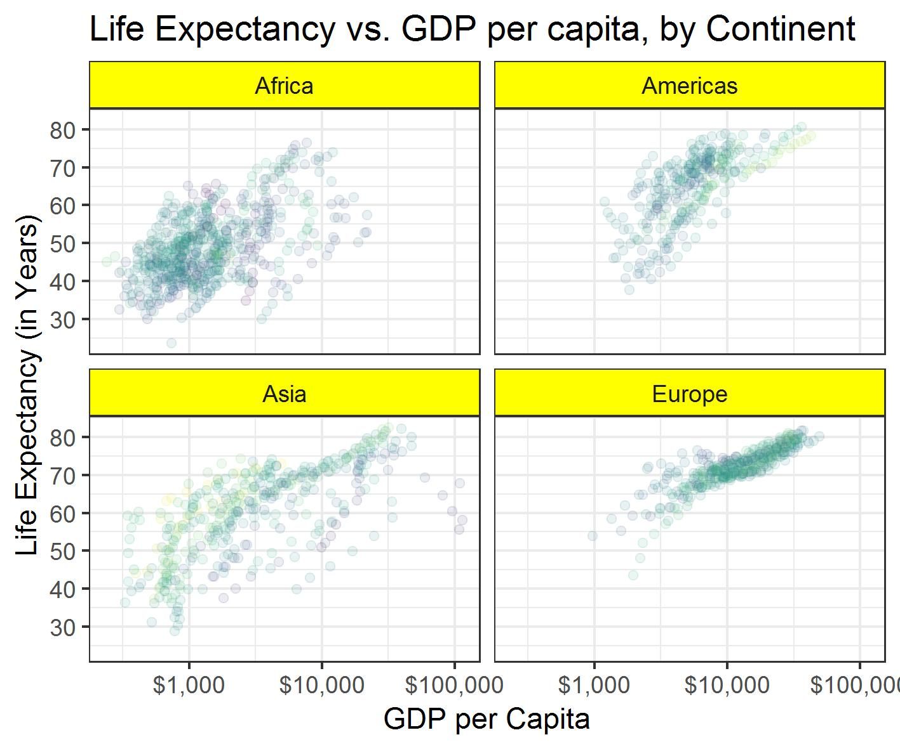
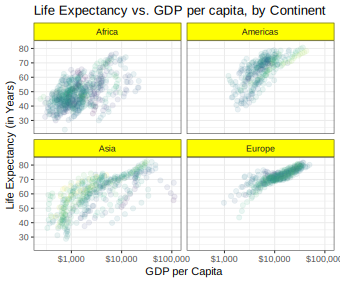

R Markdown
----------

This is the R Markdown document for hw-05, which focusses on factor and
figure management exercises from the
[**gapminder**](https://www.google.ca/search?q=gapminder+R&rlz=1C1GGRV_enCA753CA753&oq=gapminder+R&aqs=chrome..69i57j69i60j0j69i60l2j0.1349j0j7&sourceid=chrome&ie=UTF-8)
dataset.  

**Here are the goals of the assignment:**

-   Reorder a factor in a principled way based on the data and
    demonstrate the effect in arranged data and in figures.
-   Write some data to file and load it back into R.
-   Improve a figure (or make one from scratch), using new knowledge,
    e.g., control the color scheme, use factor levels,
    smoother mechanics.
-   Make a plotly visual.
-   Implement visualization design principles.

*For more information and details on the assignment, please click
[**here**](http://stat545.com/Classroom/assignments/hw05/hw05.html).*
 

**This report will be broken down into four parts:**

1.  Factor Management
2.  File Import/Export
3.  Visualization Design
4.  Writing Figures to File  

For simple reshaping, gather() and spread() from
[*tidyr*](https://tidyr.tidyverse.org/) - to help a more tidier dataset.
For data joining, there are two data sources and info from both datasets
are needed - hence a multitude of join prompts will be used to c ombine
info from both datasets into a single new object.

All of the functions used for the data reshaping and data join will be
available under the [*tidyverse*](https://www.tidyverse.org/packages/)
package. For full information about hw-04, please visit
[here](http://stat545.com/Classroom/assignments/hw04/hw04.html).

 

Open the tidyverse and gapminder Package
----------------------------------------

As usual, we will begin with loading the packages needed for the
analysis (tidyverse for functions and gapminder as the dataset of
interest). If these packages are being used for the first time on your
R-Studio client, then the packages will need to be installed first prior
to being loaded.

    # This report will use the follow packages, please install the packages to load them later on into the report

    # install.packages('tidyverse')
    # install.packages('gapminder')
    # install.packages('readr')
    # install.packages('scales')
    # install.packages('plotly')
    # install.packages('svglite')

    # Load tidyverse and gapminder
    library(tidyverse)
    library(gapminder)

 

Part 1: Factor Management
-------------------------

For this section, the focus is to **drop Oceania** and **reorder the
levels of *continent*.**

### Drop Oceania

For this sub-section, the focus will be to:

1.  Filter the Gapminder data to remove observations associated with the
    continent of Oceania.
2.  Remove unused factor levels.
3.  Provide concrete information on the data before and after removing
    these rows and Oceania and addressing the number of rows and the
    levels of the affected factors.  

First we will assign the original gapminder data to an object
(*gm\_orig*) and assign to a new object after filtering all observations
involving Oceania (*gm\_filter\_O*)

    gm_orig <- gapminder # assign original gapminder dataset to an object

    gm_filter_O <- gm_orig %>% # filter out Oceania continent observations into gm_filter_O
        filter(continent %in% c("Americas", "Africa", "Asia", "Europe"))

    # Lets view the structure of our dataset from the original gapminder data set and the dataset with Oceania observations filtered out:

    str(gm_orig)

    ## Classes 'tbl_df', 'tbl' and 'data.frame':    1704 obs. of  6 variables:
    ##  $ country  : Factor w/ 142 levels "Afghanistan",..: 1 1 1 1 1 1 1 1 1 1 ...
    ##  $ continent: Factor w/ 5 levels "Africa","Americas",..: 3 3 3 3 3 3 3 3 3 3 ...
    ##  $ year     : int  1952 1957 1962 1967 1972 1977 1982 1987 1992 1997 ...
    ##  $ lifeExp  : num  28.8 30.3 32 34 36.1 ...
    ##  $ pop      : int  8425333 9240934 10267083 11537966 13079460 14880372 12881816 13867957 16317921 22227415 ...
    ##  $ gdpPercap: num  779 821 853 836 740 ...

    str(gm_filter_O)

    ## Classes 'tbl_df', 'tbl' and 'data.frame':    1680 obs. of  6 variables:
    ##  $ country  : Factor w/ 142 levels "Afghanistan",..: 1 1 1 1 1 1 1 1 1 1 ...
    ##  $ continent: Factor w/ 5 levels "Africa","Americas",..: 3 3 3 3 3 3 3 3 3 3 ...
    ##  $ year     : int  1952 1957 1962 1967 1972 1977 1982 1987 1992 1997 ...
    ##  $ lifeExp  : num  28.8 30.3 32 34 36.1 ...
    ##  $ pop      : int  8425333 9240934 10267083 11537966 13079460 14880372 12881816 13867957 16317921 22227415 ...
    ##  $ gdpPercap: num  779 821 853 836 740 ...

 

As observed, filtering observations involving Oceania meant we lost 24
observations. Even though we filtered out the observations involving
Oceania gm\_orig, the structure of continent in both datasets still show
all levels (5 continents in total). This is also true for country, where
we still have all 142 levels/unique contries.

Levels don't always have to be present in the factor or observed in the
dataset. So even though we lost 24 observations because we filtered out
observations involving Oceania, we need to drop the unused factor level
"Oceania" as well.

There is two ways to go about this, we can either drop all unused factor
levels through *droplevels()* or drop unused factors for specific
variables via *fct\_drop()*.

    gm_filter_O %>% 
        droplevels() %>% # drop all unused factors 
        str()

    ## Classes 'tbl_df', 'tbl' and 'data.frame':    1680 obs. of  6 variables:
    ##  $ country  : Factor w/ 140 levels "Afghanistan",..: 1 1 1 1 1 1 1 1 1 1 ...
    ##  $ continent: Factor w/ 4 levels "Africa","Americas",..: 3 3 3 3 3 3 3 3 3 3 ...
    ##  $ year     : int  1952 1957 1962 1967 1972 1977 1982 1987 1992 1997 ...
    ##  $ lifeExp  : num  28.8 30.3 32 34 36.1 ...
    ##  $ pop      : int  8425333 9240934 10267083 11537966 13079460 14880372 12881816 13867957 16317921 22227415 ...
    ##  $ gdpPercap: num  779 821 853 836 740 ...

    gm_filter_O%>% 
        mutate(continent = fct_drop(continent)) %>% # only drop unused factors in continent
        str()

    ## Classes 'tbl_df', 'tbl' and 'data.frame':    1680 obs. of  6 variables:
    ##  $ country  : Factor w/ 142 levels "Afghanistan",..: 1 1 1 1 1 1 1 1 1 1 ...
    ##  $ continent: Factor w/ 4 levels "Africa","Americas",..: 3 3 3 3 3 3 3 3 3 3 ...
    ##  $ year     : int  1952 1957 1962 1967 1972 1977 1982 1987 1992 1997 ...
    ##  $ lifeExp  : num  28.8 30.3 32 34 36.1 ...
    ##  $ pop      : int  8425333 9240934 10267083 11537966 13079460 14880372 12881816 13867957 16317921 22227415 ...
    ##  $ gdpPercap: num  779 821 853 836 740 ...

 

The *droplevels()* function removed all unused factors in country and
continent - the only two factor type variables in the gapminder dataset
hence we only have 140 unique countries and 4 continents. From
droplevels, we found out that there were two countries under the Oceania
region. The *fct\_drop()* function focussed primarily on dropping unused
factors in continents, hence we have 4 continents but countries the same
- with 142 countries, as we did not drop unused Oceania countries in
this scenario.

Here is a summary for the number of rows and levels of affected factors
before and after filtering the dataset.

**Original gapminder dataset:**

-   country: 142 factors / unique countries
-   continent: 5 factors / unique continents (Africa, Americas, Asia,
    Europe, Oceania)
-   1704 total observations

**Gapminder dataset with Oceania filtered out:**

-   country: 142 factors / unique countries
-   continent: 5 factors / unique continents (Africa, Americas, Asia,
    Europe, Oceania)
-   **1680 total observations**

**Unused factor levels with drop\_levels():**

-   country: **140 factors / unique countries (countries under
    Oceania removed)**
-   continent: **4 factors / unique continents (Oceania removed)**
-   1680 total observations

**Unused factor levels with fct\_drop(continent):**

-   country: 142 factors / unique countries (only dropped unused factor
    levels under continent)
-   continent: **4 factors / unique continents (Oceania removed)**
-   1680 total observations

### Reorder the Levels of continent

**For this section, I will focus the data primarily on countries from
Europe in 2007**

For this section, we are tasked with using the *forcats* package to
change the order of the factor levels, based on a summary of one of the
quantitative variables.

    # Filter gapminder to include only observations on countries from Europe and then drop all unused factors from country and continent
    gm_Europe_2007 <- gapminder %>%
         filter(continent %in% c("Europe"), year == "2007") %>%
         droplevels() # drops all factors not pertaining to Europe

    nlevels(gm_Europe_2007$country) # Number of factors / unique countries in Europe.

    ## [1] 30

After filtering our dataset to include only European countries, we found
ourselves with 30 unique countries.

Let's say I am interested in the population of each country in our
gapminder Europe dataset, we can do our usual ggplot with geom\_point to
give a visual plot of the population for each country.

    # Create point plot with the population of each country in Europe, 2007
    gm_Europe_2007 %>% 
        ggplot(aes(pop, country)) +
        geom_point(aes(colour=country)) + # fill unique countries by different colours 
        theme_bw() + # give the graph a white background
        labs(x = "Population", y = "Country", # add labels
            title = "Scatterplot for Population by European Countries, in 2007")

 

Now this graph looks very uninformative, as the points are all over the
place. R is programmed by default to plot the points by alphabetical
order for our variable of interest (country). To rectify this problem,
we can try to change our plot to order from lowest population to highest
population.

**The plots produced in this section (Figure 2) will be raw, without
much edits - Part 3: Visualization Design will add more detail to this
plot (heading, background, axis labels, fig.height, fig.width, and
legend, etc)**

    # Create point plot with lowest to highest population in Europe, 2007
    gm_Europe_2007 %>%
        mutate(country = fct_reorder(country, pop)) %>% # points are from lowest to highest pop
        ggplot(aes(pop, country)) + 
        geom_point(aes(colour=country)) # fill unique countries by different colours

 

This looks much better, and it allows us to follow countries with
increasing population. At the same time, we can quickly spot out
countries with the lowest/highest populations. To make it even easier to
read, we can do a horizontal bar chart listing populations from lowest
population to highest,

    gm_Europe_2007 %>%
        mutate(country = fct_reorder(country, pop)) %>% # bars are from lowest to highest pop
        ggplot(aes(country,pop)) + 
        geom_bar(aes(fill=country),  stat="identity") + # fill countries by different colours
        coord_flip() + # flip country into y-axis, pop to x-axis 
        theme_bw() + # give the graph a white background
        labs(x = "Population", y = "Country", # add labels
            title = "Barchart by Increasing Population by European Countries")

 

Now lets say we are interested in France in particular, and want to
compare this to the rest of the data. We can re-order our factor to
include France as the first observation in the bottom for our visual
plot - followed by the rest of the countries, giving us a visual
comparison. We will present this in a horizontal bar chart

    gm_France <- gm_Europe_2007$country %>% 
      fct_relevel("France") # put France as first factor in country variable

    gm_Europe_2007$country <- gm_France # store the new order of factors into main dataset

    # Create bar chart with France as the first observation on the bottom, 2007
    gm_Europe_2007 %>%
        ggplot(aes(country,pop)) + 
        geom_bar(aes(fill=country),  stat="identity") + # fill countries by different colours
        coord_flip() + # flip country into y-axis, pop to x-axis
        theme_bw() + # give the graph a white background
        labs(x = "Population", y = "Country", # add labels
            title = "Barchart for Population with France as First Observation")

 

Part 2: File Import/Export
--------------------------

For the file import and export section, I will experiment with the
*write\_csv()/read\_csv()*vand *saveRDS()/readRDS()* function. The idea
is to experiment with changing the format of our 2007 European gapminder
dataset, such as changing the order of how the information is displayed
for variables, and saving it + loading it into R-Studio to see if the
format remains.

### write\_csv()/read\_csv()

The European 2007 gapminder dataset is ordered by countries in
alphabetical order. For this sub-section, I will arrange the dataset by
increasing life expectancy.

    library(readr) # load read_csv and write_csv

    # Arrange the 2007 European dataset by life expectancy (lowest to highest)
    gm_reorder_write <- gm_Europe_2007 %>%
        arrange(lifeExp) 

    gm_reorder_write %>%
    knitr::kable(caption = "This table summarizes gapminder European countries in 2007, ordered by increasing life expectancy")

<table>
<caption>This table summarizes gapminder European countries in 2007, ordered by increasing life expectancy</caption>
<thead>
<tr class="header">
<th align="left">country</th>
<th align="left">continent</th>
<th align="right">year</th>
<th align="right">lifeExp</th>
<th align="right">pop</th>
<th align="right">gdpPercap</th>
</tr>
</thead>
<tbody>
<tr class="odd">
<td align="left">Turkey</td>
<td align="left">Europe</td>
<td align="right">2007</td>
<td align="right">71.777</td>
<td align="right">71158647</td>
<td align="right">8458.276</td>
</tr>
<tr class="even">
<td align="left">Romania</td>
<td align="left">Europe</td>
<td align="right">2007</td>
<td align="right">72.476</td>
<td align="right">22276056</td>
<td align="right">10808.476</td>
</tr>
<tr class="odd">
<td align="left">Bulgaria</td>
<td align="left">Europe</td>
<td align="right">2007</td>
<td align="right">73.005</td>
<td align="right">7322858</td>
<td align="right">10680.793</td>
</tr>
<tr class="even">
<td align="left">Hungary</td>
<td align="left">Europe</td>
<td align="right">2007</td>
<td align="right">73.338</td>
<td align="right">9956108</td>
<td align="right">18008.944</td>
</tr>
<tr class="odd">
<td align="left">Serbia</td>
<td align="left">Europe</td>
<td align="right">2007</td>
<td align="right">74.002</td>
<td align="right">10150265</td>
<td align="right">9786.535</td>
</tr>
<tr class="even">
<td align="left">Montenegro</td>
<td align="left">Europe</td>
<td align="right">2007</td>
<td align="right">74.543</td>
<td align="right">684736</td>
<td align="right">9253.896</td>
</tr>
<tr class="odd">
<td align="left">Slovak Republic</td>
<td align="left">Europe</td>
<td align="right">2007</td>
<td align="right">74.663</td>
<td align="right">5447502</td>
<td align="right">18678.314</td>
</tr>
<tr class="even">
<td align="left">Bosnia and Herzegovina</td>
<td align="left">Europe</td>
<td align="right">2007</td>
<td align="right">74.852</td>
<td align="right">4552198</td>
<td align="right">7446.299</td>
</tr>
<tr class="odd">
<td align="left">Poland</td>
<td align="left">Europe</td>
<td align="right">2007</td>
<td align="right">75.563</td>
<td align="right">38518241</td>
<td align="right">15389.925</td>
</tr>
<tr class="even">
<td align="left">Croatia</td>
<td align="left">Europe</td>
<td align="right">2007</td>
<td align="right">75.748</td>
<td align="right">4493312</td>
<td align="right">14619.223</td>
</tr>
<tr class="odd">
<td align="left">Albania</td>
<td align="left">Europe</td>
<td align="right">2007</td>
<td align="right">76.423</td>
<td align="right">3600523</td>
<td align="right">5937.030</td>
</tr>
<tr class="even">
<td align="left">Czech Republic</td>
<td align="left">Europe</td>
<td align="right">2007</td>
<td align="right">76.486</td>
<td align="right">10228744</td>
<td align="right">22833.309</td>
</tr>
<tr class="odd">
<td align="left">Slovenia</td>
<td align="left">Europe</td>
<td align="right">2007</td>
<td align="right">77.926</td>
<td align="right">2009245</td>
<td align="right">25768.258</td>
</tr>
<tr class="even">
<td align="left">Portugal</td>
<td align="left">Europe</td>
<td align="right">2007</td>
<td align="right">78.098</td>
<td align="right">10642836</td>
<td align="right">20509.648</td>
</tr>
<tr class="odd">
<td align="left">Denmark</td>
<td align="left">Europe</td>
<td align="right">2007</td>
<td align="right">78.332</td>
<td align="right">5468120</td>
<td align="right">35278.419</td>
</tr>
<tr class="even">
<td align="left">Ireland</td>
<td align="left">Europe</td>
<td align="right">2007</td>
<td align="right">78.885</td>
<td align="right">4109086</td>
<td align="right">40675.996</td>
</tr>
<tr class="odd">
<td align="left">Finland</td>
<td align="left">Europe</td>
<td align="right">2007</td>
<td align="right">79.313</td>
<td align="right">5238460</td>
<td align="right">33207.084</td>
</tr>
<tr class="even">
<td align="left">Germany</td>
<td align="left">Europe</td>
<td align="right">2007</td>
<td align="right">79.406</td>
<td align="right">82400996</td>
<td align="right">32170.374</td>
</tr>
<tr class="odd">
<td align="left">United Kingdom</td>
<td align="left">Europe</td>
<td align="right">2007</td>
<td align="right">79.425</td>
<td align="right">60776238</td>
<td align="right">33203.261</td>
</tr>
<tr class="even">
<td align="left">Belgium</td>
<td align="left">Europe</td>
<td align="right">2007</td>
<td align="right">79.441</td>
<td align="right">10392226</td>
<td align="right">33692.605</td>
</tr>
<tr class="odd">
<td align="left">Greece</td>
<td align="left">Europe</td>
<td align="right">2007</td>
<td align="right">79.483</td>
<td align="right">10706290</td>
<td align="right">27538.412</td>
</tr>
<tr class="even">
<td align="left">Netherlands</td>
<td align="left">Europe</td>
<td align="right">2007</td>
<td align="right">79.762</td>
<td align="right">16570613</td>
<td align="right">36797.933</td>
</tr>
<tr class="odd">
<td align="left">Austria</td>
<td align="left">Europe</td>
<td align="right">2007</td>
<td align="right">79.829</td>
<td align="right">8199783</td>
<td align="right">36126.493</td>
</tr>
<tr class="even">
<td align="left">Norway</td>
<td align="left">Europe</td>
<td align="right">2007</td>
<td align="right">80.196</td>
<td align="right">4627926</td>
<td align="right">49357.190</td>
</tr>
<tr class="odd">
<td align="left">Italy</td>
<td align="left">Europe</td>
<td align="right">2007</td>
<td align="right">80.546</td>
<td align="right">58147733</td>
<td align="right">28569.720</td>
</tr>
<tr class="even">
<td align="left">France</td>
<td align="left">Europe</td>
<td align="right">2007</td>
<td align="right">80.657</td>
<td align="right">61083916</td>
<td align="right">30470.017</td>
</tr>
<tr class="odd">
<td align="left">Sweden</td>
<td align="left">Europe</td>
<td align="right">2007</td>
<td align="right">80.884</td>
<td align="right">9031088</td>
<td align="right">33859.748</td>
</tr>
<tr class="even">
<td align="left">Spain</td>
<td align="left">Europe</td>
<td align="right">2007</td>
<td align="right">80.941</td>
<td align="right">40448191</td>
<td align="right">28821.064</td>
</tr>
<tr class="odd">
<td align="left">Switzerland</td>
<td align="left">Europe</td>
<td align="right">2007</td>
<td align="right">81.701</td>
<td align="right">7554661</td>
<td align="right">37506.419</td>
</tr>
<tr class="even">
<td align="left">Iceland</td>
<td align="left">Europe</td>
<td align="right">2007</td>
<td align="right">81.757</td>
<td align="right">301931</td>
<td align="right">36180.789</td>
</tr>
</tbody>
</table>

    # save gm_reorder to project working directory
    write_csv(gm_reorder_write, "gm_reorder_write.csv", col_names = TRUE)

    # read gm_reorder to global environment and check if the countries are still listed by increasing life expectancy
    gm_reorder_read <- read_csv("gm_reorder_write.csv")

    ## Parsed with column specification:
    ## cols(
    ##   country = col_character(),
    ##   continent = col_character(),
    ##   year = col_integer(),
    ##   lifeExp = col_double(),
    ##   pop = col_integer(),
    ##   gdpPercap = col_double()
    ## )

    gm_reorder_read %>%
    knitr::kable(caption = "This table summarizes gapminder European countries in 2007, ordered by increasing life expectancy")

<table>
<caption>This table summarizes gapminder European countries in 2007, ordered by increasing life expectancy</caption>
<thead>
<tr class="header">
<th align="left">country</th>
<th align="left">continent</th>
<th align="right">year</th>
<th align="right">lifeExp</th>
<th align="right">pop</th>
<th align="right">gdpPercap</th>
</tr>
</thead>
<tbody>
<tr class="odd">
<td align="left">Turkey</td>
<td align="left">Europe</td>
<td align="right">2007</td>
<td align="right">71.777</td>
<td align="right">71158647</td>
<td align="right">8458.276</td>
</tr>
<tr class="even">
<td align="left">Romania</td>
<td align="left">Europe</td>
<td align="right">2007</td>
<td align="right">72.476</td>
<td align="right">22276056</td>
<td align="right">10808.476</td>
</tr>
<tr class="odd">
<td align="left">Bulgaria</td>
<td align="left">Europe</td>
<td align="right">2007</td>
<td align="right">73.005</td>
<td align="right">7322858</td>
<td align="right">10680.793</td>
</tr>
<tr class="even">
<td align="left">Hungary</td>
<td align="left">Europe</td>
<td align="right">2007</td>
<td align="right">73.338</td>
<td align="right">9956108</td>
<td align="right">18008.944</td>
</tr>
<tr class="odd">
<td align="left">Serbia</td>
<td align="left">Europe</td>
<td align="right">2007</td>
<td align="right">74.002</td>
<td align="right">10150265</td>
<td align="right">9786.535</td>
</tr>
<tr class="even">
<td align="left">Montenegro</td>
<td align="left">Europe</td>
<td align="right">2007</td>
<td align="right">74.543</td>
<td align="right">684736</td>
<td align="right">9253.896</td>
</tr>
<tr class="odd">
<td align="left">Slovak Republic</td>
<td align="left">Europe</td>
<td align="right">2007</td>
<td align="right">74.663</td>
<td align="right">5447502</td>
<td align="right">18678.314</td>
</tr>
<tr class="even">
<td align="left">Bosnia and Herzegovina</td>
<td align="left">Europe</td>
<td align="right">2007</td>
<td align="right">74.852</td>
<td align="right">4552198</td>
<td align="right">7446.299</td>
</tr>
<tr class="odd">
<td align="left">Poland</td>
<td align="left">Europe</td>
<td align="right">2007</td>
<td align="right">75.563</td>
<td align="right">38518241</td>
<td align="right">15389.925</td>
</tr>
<tr class="even">
<td align="left">Croatia</td>
<td align="left">Europe</td>
<td align="right">2007</td>
<td align="right">75.748</td>
<td align="right">4493312</td>
<td align="right">14619.223</td>
</tr>
<tr class="odd">
<td align="left">Albania</td>
<td align="left">Europe</td>
<td align="right">2007</td>
<td align="right">76.423</td>
<td align="right">3600523</td>
<td align="right">5937.030</td>
</tr>
<tr class="even">
<td align="left">Czech Republic</td>
<td align="left">Europe</td>
<td align="right">2007</td>
<td align="right">76.486</td>
<td align="right">10228744</td>
<td align="right">22833.309</td>
</tr>
<tr class="odd">
<td align="left">Slovenia</td>
<td align="left">Europe</td>
<td align="right">2007</td>
<td align="right">77.926</td>
<td align="right">2009245</td>
<td align="right">25768.258</td>
</tr>
<tr class="even">
<td align="left">Portugal</td>
<td align="left">Europe</td>
<td align="right">2007</td>
<td align="right">78.098</td>
<td align="right">10642836</td>
<td align="right">20509.648</td>
</tr>
<tr class="odd">
<td align="left">Denmark</td>
<td align="left">Europe</td>
<td align="right">2007</td>
<td align="right">78.332</td>
<td align="right">5468120</td>
<td align="right">35278.419</td>
</tr>
<tr class="even">
<td align="left">Ireland</td>
<td align="left">Europe</td>
<td align="right">2007</td>
<td align="right">78.885</td>
<td align="right">4109086</td>
<td align="right">40675.996</td>
</tr>
<tr class="odd">
<td align="left">Finland</td>
<td align="left">Europe</td>
<td align="right">2007</td>
<td align="right">79.313</td>
<td align="right">5238460</td>
<td align="right">33207.084</td>
</tr>
<tr class="even">
<td align="left">Germany</td>
<td align="left">Europe</td>
<td align="right">2007</td>
<td align="right">79.406</td>
<td align="right">82400996</td>
<td align="right">32170.374</td>
</tr>
<tr class="odd">
<td align="left">United Kingdom</td>
<td align="left">Europe</td>
<td align="right">2007</td>
<td align="right">79.425</td>
<td align="right">60776238</td>
<td align="right">33203.261</td>
</tr>
<tr class="even">
<td align="left">Belgium</td>
<td align="left">Europe</td>
<td align="right">2007</td>
<td align="right">79.441</td>
<td align="right">10392226</td>
<td align="right">33692.605</td>
</tr>
<tr class="odd">
<td align="left">Greece</td>
<td align="left">Europe</td>
<td align="right">2007</td>
<td align="right">79.483</td>
<td align="right">10706290</td>
<td align="right">27538.412</td>
</tr>
<tr class="even">
<td align="left">Netherlands</td>
<td align="left">Europe</td>
<td align="right">2007</td>
<td align="right">79.762</td>
<td align="right">16570613</td>
<td align="right">36797.933</td>
</tr>
<tr class="odd">
<td align="left">Austria</td>
<td align="left">Europe</td>
<td align="right">2007</td>
<td align="right">79.829</td>
<td align="right">8199783</td>
<td align="right">36126.493</td>
</tr>
<tr class="even">
<td align="left">Norway</td>
<td align="left">Europe</td>
<td align="right">2007</td>
<td align="right">80.196</td>
<td align="right">4627926</td>
<td align="right">49357.190</td>
</tr>
<tr class="odd">
<td align="left">Italy</td>
<td align="left">Europe</td>
<td align="right">2007</td>
<td align="right">80.546</td>
<td align="right">58147733</td>
<td align="right">28569.720</td>
</tr>
<tr class="even">
<td align="left">France</td>
<td align="left">Europe</td>
<td align="right">2007</td>
<td align="right">80.657</td>
<td align="right">61083916</td>
<td align="right">30470.017</td>
</tr>
<tr class="odd">
<td align="left">Sweden</td>
<td align="left">Europe</td>
<td align="right">2007</td>
<td align="right">80.884</td>
<td align="right">9031088</td>
<td align="right">33859.748</td>
</tr>
<tr class="even">
<td align="left">Spain</td>
<td align="left">Europe</td>
<td align="right">2007</td>
<td align="right">80.941</td>
<td align="right">40448191</td>
<td align="right">28821.064</td>
</tr>
<tr class="odd">
<td align="left">Switzerland</td>
<td align="left">Europe</td>
<td align="right">2007</td>
<td align="right">81.701</td>
<td align="right">7554661</td>
<td align="right">37506.419</td>
</tr>
<tr class="even">
<td align="left">Iceland</td>
<td align="left">Europe</td>
<td align="right">2007</td>
<td align="right">81.757</td>
<td align="right">301931</td>
<td align="right">36180.789</td>
</tr>
<tr class="odd">
<td align="left"> </td>
<td align="left"></td>
<td align="right"></td>
<td align="right"></td>
<td align="right"></td>
<td align="right"></td>
</tr>
</tbody>
</table>

As observed, the format of the re-ordered table (by increasing life
expectancy) was maintained when we wrote and read the file back into our
global environment.

### saveRDS()/readRDS()

Try the same procedure, but with *saveRDS()* and *readRDS()*

    gm_reorder_save <- gm_Europe_2007 %>%
        arrange(lifeExp) 

    # head of the reordered table
    head(gm_reorder_save) %>%
    knitr::kable(caption = "This table summarizes gapminder European countries in 2007, ordered by increasing life expectancy")

<table>
<caption>This table summarizes gapminder European countries in 2007, ordered by increasing life expectancy</caption>
<thead>
<tr class="header">
<th align="left">country</th>
<th align="left">continent</th>
<th align="right">year</th>
<th align="right">lifeExp</th>
<th align="right">pop</th>
<th align="right">gdpPercap</th>
</tr>
</thead>
<tbody>
<tr class="odd">
<td align="left">Turkey</td>
<td align="left">Europe</td>
<td align="right">2007</td>
<td align="right">71.777</td>
<td align="right">71158647</td>
<td align="right">8458.276</td>
</tr>
<tr class="even">
<td align="left">Romania</td>
<td align="left">Europe</td>
<td align="right">2007</td>
<td align="right">72.476</td>
<td align="right">22276056</td>
<td align="right">10808.476</td>
</tr>
<tr class="odd">
<td align="left">Bulgaria</td>
<td align="left">Europe</td>
<td align="right">2007</td>
<td align="right">73.005</td>
<td align="right">7322858</td>
<td align="right">10680.793</td>
</tr>
<tr class="even">
<td align="left">Hungary</td>
<td align="left">Europe</td>
<td align="right">2007</td>
<td align="right">73.338</td>
<td align="right">9956108</td>
<td align="right">18008.944</td>
</tr>
<tr class="odd">
<td align="left">Serbia</td>
<td align="left">Europe</td>
<td align="right">2007</td>
<td align="right">74.002</td>
<td align="right">10150265</td>
<td align="right">9786.535</td>
</tr>
<tr class="even">
<td align="left">Montenegro</td>
<td align="left">Europe</td>
<td align="right">2007</td>
<td align="right">74.543</td>
<td align="right">684736</td>
<td align="right">9253.896</td>
</tr>
</tbody>
</table>

    # save file to project directory via saveRDS
    saveRDS(gm_reorder_save, "gm_reorder_save.csv")

    # read file and look at the head of the reordered table again
    gm_reorder_RDS <- readRDS("gm_reorder_save.csv")

    head(gm_reorder_RDS) %>%
    knitr::kable(caption = "This table summarizes gapminder European countries in 2007, ordered by increasing life expectancy")

<table>
<caption>This table summarizes gapminder European countries in 2007, ordered by increasing life expectancy</caption>
<thead>
<tr class="header">
<th align="left">country</th>
<th align="left">continent</th>
<th align="right">year</th>
<th align="right">lifeExp</th>
<th align="right">pop</th>
<th align="right">gdpPercap</th>
</tr>
</thead>
<tbody>
<tr class="odd">
<td align="left">Turkey</td>
<td align="left">Europe</td>
<td align="right">2007</td>
<td align="right">71.777</td>
<td align="right">71158647</td>
<td align="right">8458.276</td>
</tr>
<tr class="even">
<td align="left">Romania</td>
<td align="left">Europe</td>
<td align="right">2007</td>
<td align="right">72.476</td>
<td align="right">22276056</td>
<td align="right">10808.476</td>
</tr>
<tr class="odd">
<td align="left">Bulgaria</td>
<td align="left">Europe</td>
<td align="right">2007</td>
<td align="right">73.005</td>
<td align="right">7322858</td>
<td align="right">10680.793</td>
</tr>
<tr class="even">
<td align="left">Hungary</td>
<td align="left">Europe</td>
<td align="right">2007</td>
<td align="right">73.338</td>
<td align="right">9956108</td>
<td align="right">18008.944</td>
</tr>
<tr class="odd">
<td align="left">Serbia</td>
<td align="left">Europe</td>
<td align="right">2007</td>
<td align="right">74.002</td>
<td align="right">10150265</td>
<td align="right">9786.535</td>
</tr>
<tr class="even">
<td align="left">Montenegro</td>
<td align="left">Europe</td>
<td align="right">2007</td>
<td align="right">74.543</td>
<td align="right">684736</td>
<td align="right">9253.896</td>
</tr>
<tr class="odd">
<td align="left"> </td>
<td align="left"></td>
<td align="right"></td>
<td align="right"></td>
<td align="right"></td>
<td align="right"></td>
</tr>
</tbody>
</table>

As observed, the *saveRDS()* and *readRDS()* function was also able to
save and return the re-ordered 2007 European gapminder object in the
same format.

Part 3: Visualization Design
----------------------------

For this part, I will take the **scatterplot from Figure 2** and add
labels, titles, better background use, better legend placement, etc to
give it a cleaner and more presentable look.

### Cleaning up Figure 2

    # Create point plot with lowest to highest population in Europe, 2007
    gm_Europe_2007 %>%
        mutate(country = fct_reorder(country, pop)) %>% 
        ggplot(aes(pop, country)) + 
        geom_point(aes(colour=country)) + 
        scale_x_continuous(breaks = 0:8 * (10^7)) + # x-axis break every 10^7 unites
        theme_bw() + # give the graph a white background
        labs(x = "Population", y = "Country", # add labels
            title = "Scatterplot of Increase Population for European Countries, in 2007",
            color='Legend: Country') +
        theme(legend.position="bottom")  # put legend to bottom  

### Plotly

Since the Figure 2 plot cannot be processed by plotly, I will create a
separate scatterplot detailing GDP per capita and life expectancy, with
population as a reference (legend). The resulting scatter will be broken
in continents via *facet\_wrap()*, before being put into a plotly
object. The data will be based on the gapminder dataset - all countries,
excluding Oceania countries.

    library(scales) # For scale functions below

    plotly_prep <- ggplot(gm_filter_O, aes(gdpPercap, lifeExp)) + 
          geom_point(aes(colour=pop), alpha=0.1) + # scatter of lifeExp and gdpPercap
          scale_x_log10(labels=dollar_format()) + # change scale to natural log for linearity
          scale_colour_viridis_c(
            trans   = "log10", # log transformation of our data
            breaks  = 10^(1:10), # x-axis breaks every 10^(1:10) units  
            labels  = comma_format() # add commas to x-axis labels every 10^(1:10) units 
          ) +
          scale_y_continuous(breaks=10*(1:10)) + # y-axis breaks every 10 units
          facet_wrap(~ continent) + # break into separate scatters by continent
          theme_bw() + # give the graph a white background
          labs(x = "GDP per Capita", y = "Life Expectancy (in Years)", 
          title = "Life Expectancy vs. GDP per capita, by Continent",
          color='Population') + # add labels to axis, title, legend
          theme(strip.background = element_rect(fill = "yellow"),
              legend.position = "none") # title header bg color, leave out legend
           
    print(plotly_prep)

%20vs.%20GDP%20per%20capita,%20by%20Continent,%20-1.png)
 

Lastly, we will run a scatterplot for all countries into one through the
*plotly* function and see what kind of new information we can achieve
through a plotly object.

    library(plotly)
    # ggplotly(plotly_prep) if you're using .md, please see .html file for the plotly plot

    # Could not find a way to remove the overlay of x-axis and y-axis on the axis units

 

As we can see, the plotly function allows us to have light interaction
with the plot. When we hover over the data points, it will give us its
coordinates. The ggplot2 scatter only displays the points on the
scatter. I had issues with the overlay of the x-axis with the axis
units.

Part 4: Writing Figures to File
-------------------------------

For this section, I will be using the *ggsave()* function to save a
ggplot into the project directory. The same plot will be saved on raster
format (.jpg) and vector format (.svg)

    # Save as raster image (jpg)
    ggsave("Figure 6 ggplot.jpg", plot = plotly_prep, units = "cm", height = 10, width = 12)

 

The file has been saved as a .jpg file, with a dimension of 12 cm by 10
cm. Sizing can be adjusted through height and width and depending on
which unit measurement calibration you're interested in, there are other
options such as inches ("in") or millimetre ("mm").

Here is the code to save the ggplot as a .svg file.

    # Save as raster image (jpg)
    library(svglite)
    ggsave("Figure 6 ggplot.svg", plot = plotly_prep, units = "cm", height = 10, width = 12)

Here is the code to load the saved .jpg and .svg file:

    
    

 
